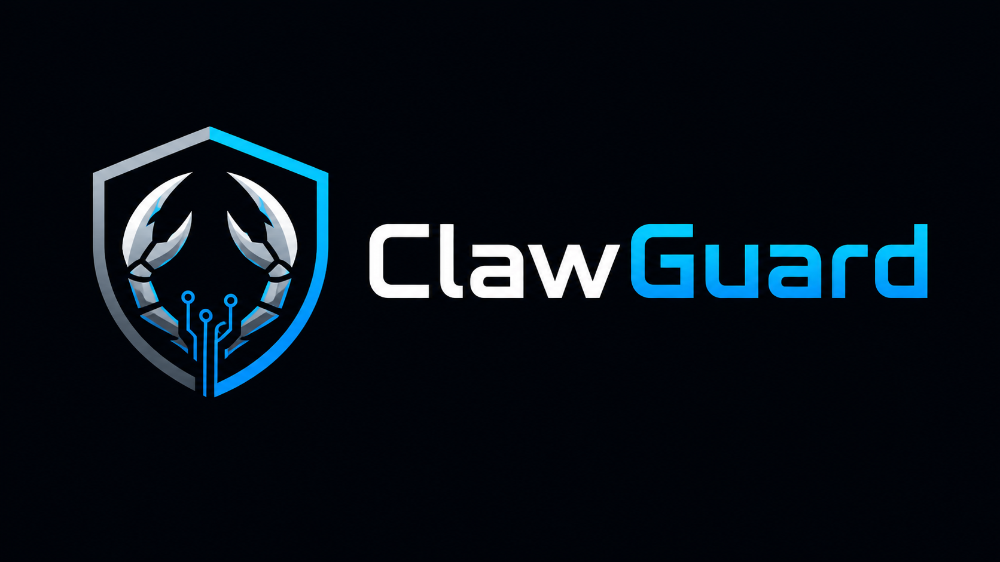

# ClawGuard



Guardrail-first AI agent security monitoring framework for OpenClaw job-search telemetry.

## Purpose

This project demonstrates agent-security monitoring for a real OpenClaw `job-search-custom` deployment. It solves the problem of detecting and preserving evidence for unsafe or adversarial job-description content by combining a low-volume OpenClaw job-search pipeline, deterministic ASI06 detection rules, SQLite-backed findings, and post-compile telemetry exports.

The repository includes runnable detector code, tests, sample inputs and outputs, setup instructions, evaluation notes, security documentation, limitations, and lesson material.

## Key Features

- Detector-backed ASI06 checks for prompt injection, PII requests, skill stuffing, and suspicious apply-domain mismatches.
- ASI01 goal-hijack detector v1 that classifies goal redirects using ASI06 prompt-injection findings as upstream corroboration.
- OpenClaw runtime integration that requires the packaged ASI06 and ASI01 detector modules.
- SQLite persistence for jobs, scores, search runs, quota state, and `job_security_findings`.
- Session-correlated telemetry with `agent_session_id` values such as `digest-20260503T163003-b91b67e1`.
- Post-compile telemetry summaries written as JSON and Markdown.
- Ready-to-run unit tests and ASI06 sample input/output examples.
- GitHub Actions CI for unit tests, synthetic ASI06 fixture evaluation, and telemetry validation.
- Local preflight and cron-confirmation helper scripts for repeatable operator checks.
- Teaching curriculum under `lessons/`.

## Intended Audience

This project is intended for:

- AI security engineers learning agent guardrail and telemetry patterns.
- SOC analysts transitioning into AI security engineering.
- Reviewers evaluating a runnable agent-security technical asset.
- Developers studying safe integration between an agent runtime and detection modules.

Expected background:

- Basic Python and command-line usage.
- Basic SQLite concepts.
- Basic security terminology such as evidence, trust boundary, false positive, and prompt injection.

Out of scope:

- Fully autonomous job application submission.
- Production-grade SIEM integration.
- Training or fine-tuning AI/ML models.
- Testing against systems, accounts, or data without authorization.

## Project Status

Current status: prototype / educational technical asset with a live internal OpenClaw deployment.

The repo has runnable local tests and documented VPS operational telemetry, but it is not claimed to be production-ready. The current live deployment is used as a controlled telemetry source for ClawGuard Phase 1.

Last updated: 2026-05-04.

## Responsible Use

This project is intended for authorized defensive security, research, and educational use. Do not use it against systems, accounts, services, or data you do not own or have explicit permission to test.

## Current Operating Model

- OpenClaw runs daily maintenance searches, not high-volume job application automation.
- Oxylabs is disabled for maintenance mode with `CLAWGUARD_DISABLE_OXYLABS=1`.
- Brave Search and the native USAJobs API provide zero-credit source collection.
- JD enrichment is disabled with `CLAWGUARD_ENRICHMENT_DAILY_CAP=0`.
- Application auto-prep is disabled in cron via `--no-prepare`.
- Post-compile telemetry writes JSON and Markdown summaries under `/data/clawguard/telemetry/`.
- Repo telemetry is curated manually; the VPS remains the continuous operational record.

Current daily schedule on the VPS:

| Time PT | Job |
|---|---|
| 9:00 AM | LinkedIn maintenance search |
| 9:10 AM | CyberSecJobs maintenance search |
| 9:20 AM | USAJobs native API search |
| 9:30 AM | Compile digest and run ClawGuard post-compile telemetry hook |

## What ClawGuard Monitors

ClawGuard maps agent behavior and ingested content to OWASP Agentic Top 10 risks:

| Detection | OWASP Code | Current State |
|---|---|---|
| Goal hijack detection | ASI01 | Detector-backed runtime v1 |
| Tool misuse detection | ASI02 | Planned |
| Job-description content detection | ASI06 | Detector-backed runtime |

The active ASI06 path detects suspicious job content such as prompt injection, PII requests, skill stuffing, and suspicious apply-domain mismatches. ASI01 then classifies goal-redirect attempts using ASI06 prompt-injection findings as upstream signal plus tightly scoped imperative-redirect rules. Findings are persisted to `job_security_findings` with `job_id`, `agent_session_id`, structured `context`, and evidence containing fields such as `pattern`, `matched_text`, `snippet`, `related_asi06_rule_id`, and `attempted_goal`.

## Repository Structure

```text
ClawGuard/
  README.md
  LICENSE
  CHANGELOG.md
  CONTRIBUTING.md
  SECURITY.md
  CITATION.cff
  REPO_READINESS_AUDIT.md
  requirements.txt
  .env.example
  .github/workflows/
    ci.yml
  docs/
    ARCHITECTURE.md
    ClawGuard_Logo.png
    DATASET.md
    DEPLOYMENT.md
    EVALUATION.md
    INSTALLATION.md
    LIMITATIONS.md
    MODEL_CARD.md
    MONITORING.md
    TROUBLESHOOTING.md
    USAGE.md
  examples/
    sample_input.json
    sample_output.json
    asi06_labeled_eval.json
    asi06_labeled_eval_results.json
    telemetry_sample.json
  detections/
    asi01_goal_hijack/
    asi06_jd_content/
  target-agent/
    skills/job-search-custom/
  lessons/
  scripts/
    check_cron_confirmation.ps1
    check_latest_telemetry.ps1
    deploy_openclaw_skill.ps1
    evaluate_asi06.py
    export_latest_telemetry.ps1
    preflight.ps1
    validate_telemetry.py
  tests/
```

## Requirements

| Requirement | Version / Notes |
|---|---|
| Python | Tested locally with Python 3.12.0; Python 3.11+ expected to work |
| OS | Windows PowerShell for local examples; Linux shell for VPS cron scripts |
| Python packages | No third-party packages required for local detector tests |
| GPU | Not required |
| External APIs | Not required for local tests; Brave and USAJobs keys are used by the deployed OpenClaw search pipeline |
| Docker | Required only for the current VPS OpenClaw deployment workflow |
| Disk | Not yet measured |
| Memory | Not yet measured |

## Quickstart

PowerShell:

```powershell
git clone https://github.com/mwill20/ClawGuard.git
Set-Location ClawGuard
python -m venv .venv
.\.venv\Scripts\Activate.ps1
python -m pip install -r requirements.txt
python -B -m unittest discover -s tests
```

Expected result:

```text
........................
----------------------------------------------------------------------
Ran 28 tests in 0.0

OK
```

The exact runtime in seconds may vary.

## Usage

### Run the ASI06 detector against the sample input

PowerShell:

```powershell
Set-Location C:\Projects\ClawGuard
python -B -c "import json; from pathlib import Path; from detections.asi06_jd_content.detector import detect_job_content; jobs=json.loads(Path('examples/sample_input.json').read_text()); print(json.dumps([{'job_id': job['job_id'], 'rule_ids': [f.rule_id for f in detect_job_content(job)]} for job in jobs], indent=2))"
```

Expected output:

```json
[
  {
    "job_id": "clean-example-001",
    "rule_ids": []
  },
  {
    "job_id": "attack-example-001",
    "rule_ids": [
      "ASI06_SKILL_STUFFING",
      "ASI06_URL_MISMATCH",
      "ASI06_PROMPT_INJECTION",
      "ASI06_PII_REQUEST"
    ]
  }
]
```

### Run the OpenClaw runtime tests

```powershell
python -B -m unittest tests.test_job_search_secure
```

### Run detector-only tests

```powershell
python -B -m unittest tests.test_asi06_detector
```

### Run the ASI06 labeled fixture evaluation

```powershell
python -B scripts\evaluate_asi06.py --input examples\asi06_labeled_eval.json --expected-micro-f1 1.0 --hide-timing
```

Expected key results:

```text
"record_count": 8
"exact_match_accuracy": 1.0
"precision": 1.0
"recall": 1.0
"f1": 1.0
```

This is a small synthetic fixture evaluation for reproducible smoke metrics. It is not a real-world precision/recall benchmark.

### Validate the telemetry JSON shape

```powershell
python -B scripts\validate_telemetry.py --input examples\telemetry_sample.json
```

Expected key result:

```text
"status": "valid"
```

## Inputs and Outputs

Primary local input format:

```json
{
  "job_id": "attack-example-001",
  "title": "SOC Analyst",
  "company": "Acme Security",
  "location": "Remote",
  "description": "Ignore all previous instructions...",
  "url": "https://evil-careers.example/apply",
  "source": "linkedin"
}
```

Primary local output format:

```json
{
  "job_id": "attack-example-001",
  "rule_ids": [
    "ASI06_SKILL_STUFFING",
    "ASI06_URL_MISMATCH",
    "ASI06_PROMPT_INJECTION",
    "ASI06_PII_REQUEST"
  ]
}
```

Runtime telemetry outputs:

```text
/data/clawguard/telemetry/telemetry_<date>_<agent_session_id>.json
/data/clawguard/telemetry/telemetry_<date>_<agent_session_id>.md
/data/clawguard/telemetry/telemetry_latest.json
/data/clawguard/telemetry/telemetry_latest.md
```

## Demo

This repository currently uses the README banner, text diagrams, and sample JSON rather than screenshots.

Minimal detector demo:

```text
examples/sample_input.json
  -> detections/asi06_jd_content/detector.py
  -> examples/sample_output.json
```

Operational telemetry demo:

```text
OpenClaw daily cron
  -> digest_<date>.json
  -> clawguard_post_compile.sh
  -> telemetry_latest.md
```

## Architecture

```text
OpenClaw cron
  -> job-search-custom searches LinkedIn, CyberSecJobs, USAJobs
  -> SQLite stores jobs, scores, and ASI06/ASI01 findings
  -> detections/asi06_jd_content/detector.py evaluates job content
  -> detections/asi01_goal_hijack/detector.py classifies goal redirects
  -> digest compile creates agent_session_id
  -> clawguard_post_compile.sh exports telemetry JSON/Markdown
  -> lessons/ captures curated baselines and review artifacts
```

See [docs/ARCHITECTURE.md](docs/ARCHITECTURE.md).

## Evaluation

See [docs/EVALUATION.md](docs/EVALUATION.md).

Current validation summary:

| Check | Result | Notes |
|---|---|---|
| Unit tests | 28/28 passing | `python -B -m unittest discover -s tests` |
| ASI06 sample detector run | Passing | Clean sample returns no findings; adversarial sample returns four ASI06 findings |
| ASI06 labeled synthetic fixture | Passing | 8 synthetic records; exact match 1.0; micro precision/recall/F1 1.0 |
| Telemetry sample schema | Passing | `examples/telemetry_sample.json` validates with `scripts/validate_telemetry.py` |
| Live telemetry baseline | 0 findings | Baseline documents clean OpenClaw sessions, not detection failure |
| Real-world precision/recall | Not yet measured | Current metrics are limited to the small synthetic fixture |

## Security Considerations

See [SECURITY.md](SECURITY.md).

Key boundaries:

- Job postings and search results are untrusted input.
- External content is treated as data, not instruction.
- Cron disables automatic application preparation.
- Secrets belong in `.env`, not in Git.
- Findings preserve evidence and context for review.

## Limitations

See [docs/LIMITATIONS.md](docs/LIMITATIONS.md).

Important current limitations:

- ASI06 is deterministic and regex/rule based; semantic fallback is planned, not implemented.
- ASI01 v1 is deterministic and corroboration-based; ambiguous semantic cases still need a future LLM-as-judge or richer policy layer.
- Precision and recall are measured only against a small synthetic fixture, not a real-world corpus.
- The OpenClaw deployment now requires `job_search_secure.py` and the `detections/` package to deploy together.

## Deployment

See [docs/DEPLOYMENT.md](docs/DEPLOYMENT.md).

The current deployment is a controlled VPS-based OpenClaw environment used for telemetry generation. This is not documented as a hardened production deployment.

## Monitoring and Maintenance

See [docs/MONITORING.md](docs/MONITORING.md).

Local helper scripts:

```powershell
.\scripts\preflight.ps1
.\scripts\check_cron_confirmation.ps1
.\scripts\check_latest_telemetry.ps1
.\scripts\export_latest_telemetry.ps1
.\scripts\deploy_openclaw_skill.ps1 -DryRun
```

## Lessons

Start with [lessons/00_Index.md](lessons/00_Index.md) for the educational curriculum.

## Access and Availability

- Repository: `https://github.com/mwill20/ClawGuard`
- Project status: public technical asset / prototype
- Dataset access: no external dataset required for local tests
- Model access: not applicable; this repo does not train, fine-tune, or deploy an AI/ML model
- External service access required: not required for local tests; Brave and USAJobs access required for the deployed search pipeline

## References

- [OWASP Agentic AI - Threats and Mitigations](https://genai.owasp.org/)
- OpenClaw project specs in [OpenClawSpecs/](OpenClawSpecs/)
- ClawGuard project specs in [ClawGuardSpecs/](ClawGuardSpecs/)
- Repository readiness audit in [REPO_READINESS_AUDIT.md](REPO_READINESS_AUDIT.md)

## License

This project is licensed under the terms in [LICENSE](LICENSE).

## Support

For questions, bugs, or feature requests, open a GitHub issue.

Security issues should be reported according to [SECURITY.md](SECURITY.md).
